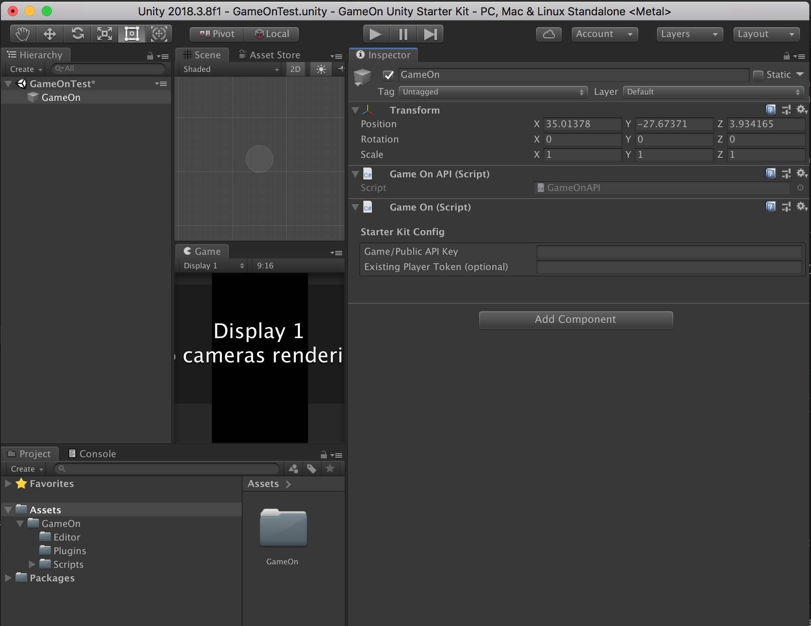

# GameOn Unity Starter Kit

With the GameOn Unity Starter Kit, Unity game developers can easily test all the basic endpoints that [GameOn Game API](https://developer.amazon.com/docs/gameon/game-api-ref.html) provides before even integrating them in their game client.

## Getting Started

These instructions will get you a copy of the project up and running on your local machine for development and testing purposes.

### Prerequisites

* Latest verison of Unity that can be downloaded from [here](https://unity3d.com/get-unity/download). This starter kit was tested using Unity 2018.3.8f1.
* Public API key for the game registered with GameOn. Please follow the instructions [here](https://developer.amazon.com/docs/gameon/manage-games.html) to plug in your first game to GameOn. Please note that while registering the game do not select "Enable advanced security". This starter kit will not work for such games.
* At least one ongoing competition for the game that you registered above. You can create one from GameOn Console as shown [here](https://developer.amazon.com/docs/gameon/manage-competitions.html). If it is your first competition, then you can create it with the default values. Just ensure that competition starts now so that you can see it while running the application.

### Setup

* Download or git clone this repository.
* Launch Unity, click Open, navigate to the folder where you downloaded the repository and select "gameon-starter-kit-unity" folder.
* Inside Unity, select "File > Open Scene", navigate to "gameon-starter-kit-unity" folder, and choose "Assets > GameOn > GameOnTest.unity".
* Select "GameOn" game object under the "GameOnTest" scene and you're ready to run the application.

  

### Run

* Click the "Play" button at the top to start
* Enter the public API key for your game (see [Prerequisites](#prerequisites))
* Ignore the "Existing Player Token" field for now. We'll revisit it later.
* Click on "Register New Player" button. This is equivalent of [Register Player](https://developer.amazon.com/docs/gameon/game-api-std-security.html#register-player) operation in GameOn API.
* Once you see "Player Token" field populated under "Current Player Info" section, proceed further. 
* Enter "Player Name". This is optional and if you don't provide it, GameOn will create one for you.
* Click the "Authenticate Player" button. This corresponds to [Authenticate Player](https://developer.amazon.com/docs/gameon/game-api-std-security.html#authenticate-the-player) operation in GameOn API.
* Please see the value for "Session Expiration Date". At this time, session will expire and you will have to authenticate this player again. That's where "Player Token" field comes into picture. If you have player token saved somewhere, you can then next time when you run the kit, you can skip "Register Player" by entering "Player Token" and directly proceed for "Authenticate Player".
* At this point, if you have ongoing competitions, you should see them when you click "Get Tournament List" button. Please refer to [this](https://developer.amazon.com/docs/gameon/game-api-ref.html#get-tournaments) for more details about the "Get Tournaments" operation.
* Against each tournament that showed up, you will see "Enter Tournament" button. Clicking on this will enter the player that you just authenticated into that tournament. Behind the scene, GameOn finds an open match and enters the player into it. This is considered the first attempt for the player. Details about "Enter Tournament" operation can be found [here](https://developer.amazon.com/docs/gameon/game-api-ref.html#enter-tournament).
* Once entered successfully, you can submit score for this player by clicking "Submit Score" button against the tournament. You can find more information about "Submit Score" operation [here](https://developer.amazon.com/docs/gameon/game-api-ref.html#submit-score). 
* On successful score submission, kit calls "Get Leaderboard" operation automatically to get the top 10 scores in the match. This operation support multiple options like finding the rank of the player, getting the top n neighbors etc. For more details, please click [here](https://developer.amazon.com/docs/gameon/game-api-ref.html#get-leaderboard)
* To have player submit score again for the same match, click on "Enter Match" button. This operation allows players to make more than one attempt in a match. For more information, please see [this](https://developer.amazon.com/docs/gameon/game-api-play-tournament.html).

This covers all the basic operations that GameOn API provides. For the comprehensive list of operations, please consult the [API reference](https://developer.amazon.com/docs/gameon/game-api-ref.html).

## Contributing

Please read [CONTRIBUTING.md](CONTRIBUTING.md) for details on our code of conduct, and the process for submitting pull requests to us.

## License

This library is licensed under the Apache 2.0 License - see the [LICENSE](LICENSE) file for details

## Acknowledgments

* [Jesse Freeman](https://github.com/jessefreeman)
* [Justin Maneri](https://github.com/BinaryShrub)
* [Kaushik Chakraborti](https://github.com/kodesharp)
